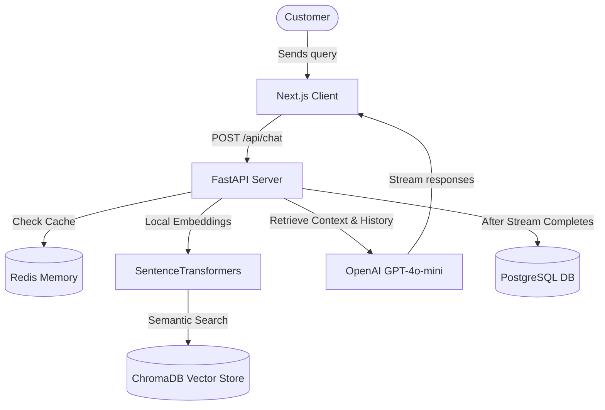

# SupportIQ AI — AI-Powered Customer Support Assistant MVP

SupportIQ AI is a production-grade, real-time AI customer support chatbot MVP. It leverages Retrieval-Augmented Generation (RAG) to search uploaded documents, maintains conversation history using Redis, compiles performance metrics for an admin analytics dashboard, and supports streaming responses.

---

## 🏗️ Architecture Overview

The application is structured into three main layers:

1. **Frontend (Next.js)**: A responsive React dashboard designed with TailwindCSS, Lucide Icons, and Recharts, utilizing Axios and React Query for asynchronous API states.
2. **Backend (FastAPI)**: An asynchronous Python web service handling session memory matching, RAG operations, relational databases management, and CORS routing.
3. **Storage & AI Infrastructure**:
   - **PostgreSQL**: Stores persistent relational entities (Users, Chats history logs, Feedback ratings).
   - **Redis**: Caches recent conversation transcripts for short-term memory retrieval.
   - **ChromaDB**: In-process Vector DB storing local document embeddings.
   - **Sentence-Transformers (`all-MiniLM-L6-v2`)**: Generates 384-dimensional text vectors locally (100% offline, saving OpenAI API costs).
   - **OpenAI GPT-4o-mini**: Generates friendly, context-grounded final chat responses.



---

## ⚙️ Environment Variables (`.env`)

Create a `.env` file in the root workspace folder with these parameters:

```env
# Mode
ENVIRONMENT=development

# OpenAI Key for response generation
OPENAI_API_KEY=sk-proj-...

# Database configurations
# Fallback to local SQLite file for immediate out-of-the-box local running
DATABASE_URL=sqlite:///./supportiq.db

# Redis endpoint
# Keep blank to use in-memory dictionary session cache fallback
REDIS_URL=

# Chroma Vector DB settings
# Keep blank to run local persistent vector storage at ./chroma_db
CHROMA_SERVER_HOST=
CHROMA_SERVER_PORT=8000
CHROMA_PERSIST_DIR=./chroma_db

# Frontend coordinates
NEXT_PUBLIC_API_URL=http://localhost:8000
```

---

## 🚀 Local Development (Fast Start)

You can run SupportIQ AI locally on your host machine immediately with zero external dependencies (thanks to automatic SQLite, local ChromaDB, and in-memory Redis fallbacks).

### 1. Prerequisites
- **Node.js**: v18+ (tested on v26)
- **Python**: 3.11+

### 2. Backend Setup
1. Navigate into the backend folder:
   ```bash
   cd backend
   ```
2. Create and source a Python virtual environment:
   ```bash
   python3 -m venv venv
   source venv/bin/activate
   ```
3. Install Python dependencies:
   ```bash
   pip install -r requirements.txt
   ```
4. Run the FastAPI development server:
   ```bash
   python3 -m app.main
   ```
   *The server starts on [http://localhost:8000](http://localhost:8000). Relational tables will initialize automatically on start.*

### 3. Frontend Setup
1. Open a new terminal and navigate to the frontend folder:
   ```bash
   cd frontend
   ```
2. Install npm packages:
   ```bash
   npm install
   ```
3. Launch the Next.js development client:
   ```bash
   npm run dev
   ```
   *Open [http://localhost:3000](http://localhost:3000) in your browser.*

---

## 🐳 Running with Docker (Production Ready)

If you have Docker Desktop installed, you can orchestrate the complete environment (including true PostgreSQL, Redis, and ChromaDB servers) in one command:

1. Ensure your `.env` has your `OPENAI_API_KEY` defined.
2. Build and launch all services:
   ```bash
   docker-compose up --build
   ```
3. The services are mapped as follows:
   - **Frontend**: [http://localhost:3000](http://localhost:3000)
   - **Backend**: [http://localhost:8000](http://localhost:8000)
   - **PostgreSQL**: Port 5432
   - **Redis**: Port 6379
   - **ChromaDB**: Port 8001

---

## 📁 Project Directory Structures

```text
supportiq-ai/
├── backend/                  # FastAPI Application
│   ├── app/
│   │   ├── api/              # Routers (/chat, /analytics, /upload, etc.)
│   │   ├── core/             # Base configurations loader
│   │   ├── database/         # SQLAlchemy session connection
│   │   ├── models/           # DB schema schemas definitions (User, Chat, Feedback)
│   │   ├── schemas/          # Pydantic validation validation rules
│   │   ├── services/         # OpenAI GPT streaming pipeline
│   │   ├── rag/              # ChromaDB client & sentence-transformers ingestion
│   │   ├── memory/           # Redis memory controller & cache fallbacks
│   │   └── main.py           # FastAPI entrypoint & middleware CORS
│   ├── Dockerfile
│   └── requirements.txt
├── frontend/                 # Next.js Application
│   ├── app/                  # App Router Pages (Home, Chat, Analytics, Settings)
│   ├── components/           # Responsive Sidebar navigation
│   ├── services/             # Axios API mapping & Native Fetch Streams
│   ├── styles/               # Glassmorphism globals styles overrides
│   ├── Dockerfile
│   └── package.json
├── docker-compose.yml        # Services Orchestrator
└── README.md                 # System Guide (This document)
```

---

## 🔌 API Endpoints Documentation

### 1. `POST /api/chat`
Sends a query to the AI assistant, fetching matching RAG context.
- **Request Body**:
  ```json
  {
    "session_id": "session_uuid_12345",
    "message": "How do I install the product?"
  }
  ```
- **Response**: Server-Sent streaming chunks of response text, ending with a metadata marker `[CHAT_ID:x]` representing the stored SQL record.

### 2. `GET /api/history`
Retrieves conversation history for a session.
- **Query Params**: `session_id=session_uuid_12345`
- **Response**: List of past exchanges.

### 3. `POST /api/feedback`
Logs user rating.
- **Request Body**:
  ```json
  {
    "chat_id": 42,
    "rating": 5,
    "comment": "Perfect answer!"
  }
  ```

### 4. `GET /api/analytics`
Fetches system KPI values and charts datasets for the admin dashboard.

### 5. `POST /api/upload`
Uploads PDF/TXT manual sources to index. Must be sent as `multipart/form-data`.
